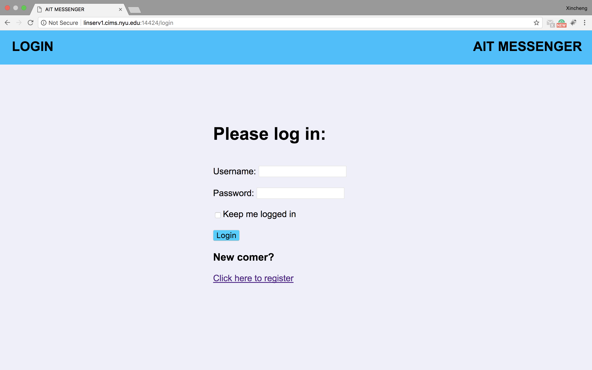
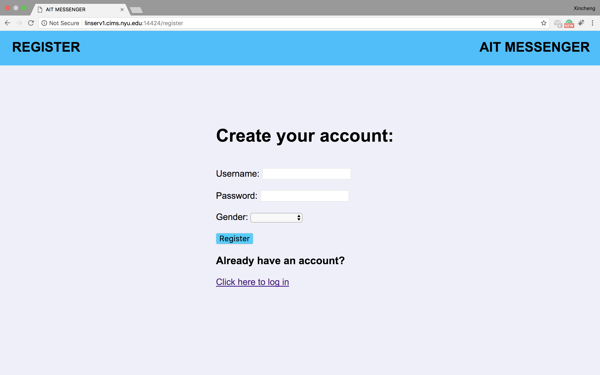
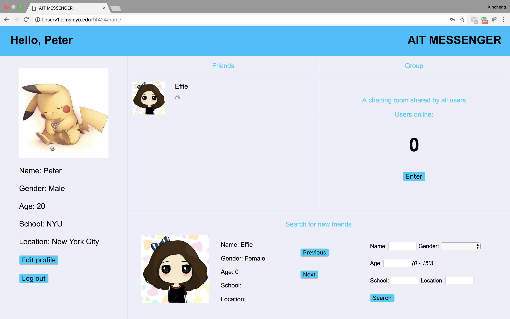
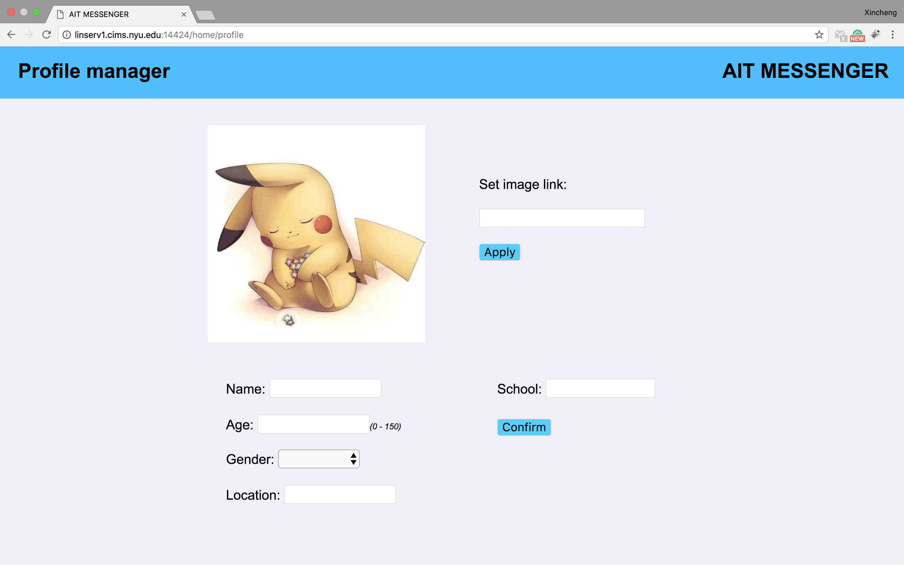
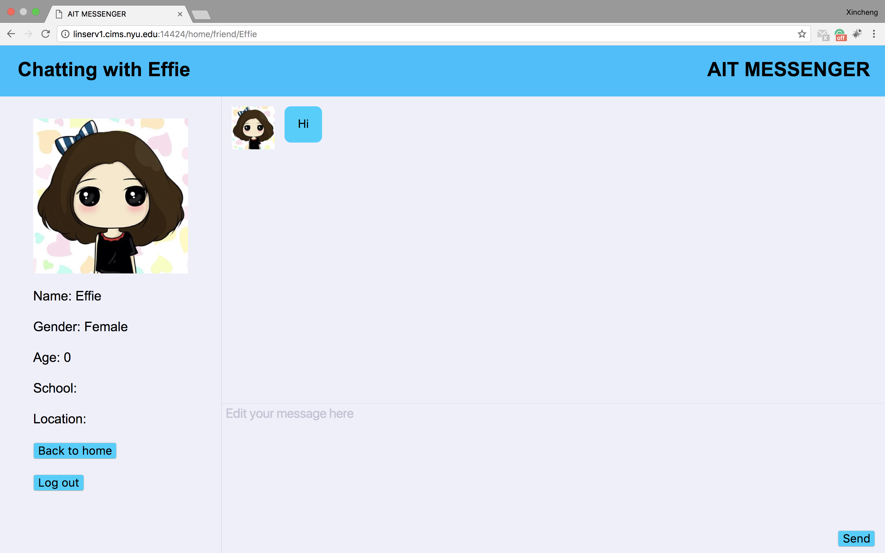
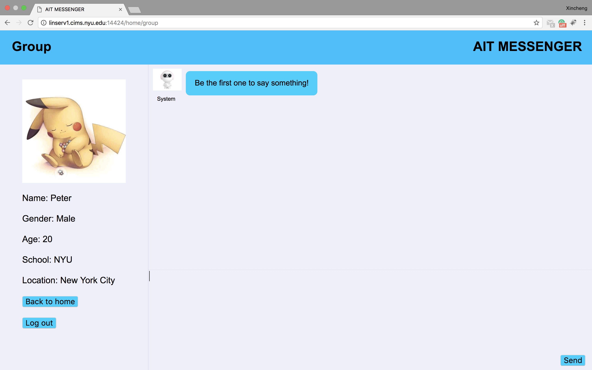
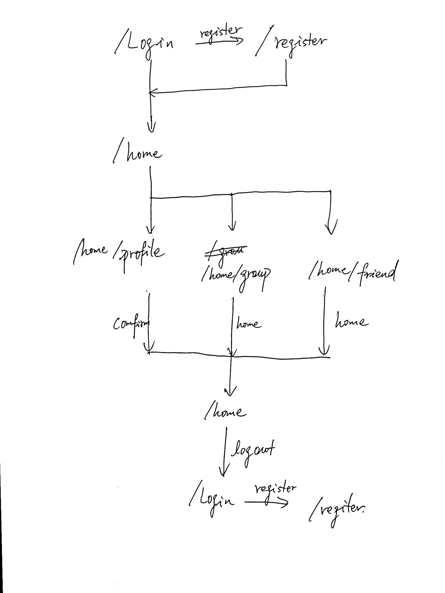

# A Multi-client Fully Functional Chatting Web App
# - AIT Messenger

## Overview

In an earlier class I have taken about computer networking, we are taught how to
make a online chatting program. However, what we did in that class was just a simple
and rough program that only allows chatting in a single group with all the users
online. And the interface was inside terminal.

Therefore, I would like to take the chance of this final project to perfect that
program and build a chatting web app that possess most functions of a real messenger.
This means that the app will:

- allow user to sign up, log in, and log out.
- allow the option of remain logged in
- allow both group chatting and one to one chatting.
- save messaged for offline users to retrieve when back online
- allow friend searching and maintain a friend list.
- store an amount of chatting history for reviewing in the chat window

## Data Model

The application will store user information, group information, and chat histories
- Each user has a separate history schema to remember all the message he sends to other user
- Each user has a logininfo schema that stores their encrypted information such as password, supported by passportjs
- Each users have the database keep their information (personal profile, name, password, etc.)

An Example User:

```javascript
{
    username: {type: String, required: [true, "Username cannot be absent"]},
    online: Boolean,
    groups: [Number], // groupids
    friends: [String], // username
    // profile
    name: String,
    img: String, // a link, at least for now
    gender: String,
    age: Number,
    school: String,
    location: String,
    history: [Hist]
}
```

An Example History Schema:

```javascript
{
    friend: String,
    history: [String],
    pending_msgs: Number
}
```

An Example group schema
```javascript
{
    member: Number,
    history: [[]] // [[userid, String], [userid, String] ...]
}
```

## [Link to Commented First Draft Schema](db.js)

## Wireframes

/login - page for user to log in



/register - page for user to register



/home - homepage



/home/profile - profile settings



/home/friend - page for one-to-one friend chatting (ajax to be used here)



/home/group - page for group chat (ajax to be used here as well)



## Site map



## User Stories or Use Cases

1. as non-registered user, I can register a new account with the site
2. as a user, I can log in to the site and stay logged in for a certain period
3. as a user, I can search for friends
4. as a user, I can send or receive messages in one-to-one conversations
5. as a user, I can join the group shared by all users to say something
6. as a user, I can go offline and still maintain access to any message received
during that offline period when back online
7. as a user, I can manage my profile

## Research Topics

* (5 points) Integrate user authentication
    * I'm going to be using passport for user authentication
    * When creating a new account, an email with password will be sent
* (3 points) Client side form validation
    * I am going to use custom javascript to perform form validation
    * perform form validation on the registration page and profile editing page

8 points total out of 8 required points

## [Link to Initial Main Project File](app.js)

## Annotations / References Used

1.[passport.js authentication docs](http://passportjs.org/docs) - (add link to source code that was based on this)
